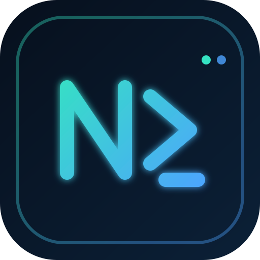

<!-- NusaTerminal Profile README -->

<p align="center">
  
</p>

<h1 align="center">NUSA TERMINAL</h1>

<p align="center">
  <strong>Evidence before execution.</strong><br/>
  Trading intelligence built to turn market data into decisions that can be explained, tested, and controlled.
</p>

<p align="center">
  <a href="https://nusaterminal.com">Website</a>
  ·
  <a href="https://github.com/NusaTerminal">GitHub</a>
</p>

---

## What is Nusa Terminal?

**Nusa Terminal** is a trading-intelligence platform designed around one principle:

> **Automation should earn permission to act.**

Instead of jumping from signal to execution, Nusa Terminal is built to collect market evidence, evaluate signals, test ideas, surface risk, and only then allow automation to move forward.

Our focus is not simply faster trading. It is **more accountable decision-making**.

## Core Philosophy

```text
MARKET DATA
    ↓
SIGNALS
    ↓
EVIDENCE
    ↓
BACKTEST / VALIDATION
    ↓
RISK GATE
    ↓
ARM / WARN / REFUSE
    ↓
EXECUTION
```

Every automated action should have a reason, a confidence level, and a boundary.

## What We're Building

- **Real-time Market Intelligence** — live market context, price movement, and actionable monitoring.
- **Signal Engine** — structured signals instead of isolated indicators.
- **Backtesting** — test ideas against historical behavior before trusting them.
- **Overnight Radar** — surface important market developments while the user is away.
- **Evidence Gate** — evaluate whether an automated action should be `ARM`, `WARN`, or `REFUSE`.
- **Automation with Guardrails** — execution should happen only after evidence and risk checks pass.
- **Transparent Decision Trail** — make it possible to understand why a decision was produced.

## Why Nusa Terminal?

Markets are noisy. Automation can make that noise move faster.

Nusa Terminal is being built to add a layer between **signal** and **action** — a layer that asks:

- What evidence supports this?
- Has the idea been tested?
- What can invalidate it?
- What is the risk?
- Should the system act at all?

That is the foundation behind **Evidence before execution**.

## Project Status

Nusa Terminal is under active development.

This GitHub profile will contain the public engineering work, documentation, experiments, and components that support the platform as they are released.

## Engineering Principles

- Evidence over impulse
- Explainability over black-box behavior
- Risk controls before automation
- Reproducible research
- Secure-by-default architecture
- Clear separation between analysis and execution
- Human oversight where it matters

## Connect

🌐 **Website:** https://nusaterminal.com  
💻 **GitHub:** https://github.com/NusaTerminal

---

<p align="center">
  <strong>NUSA TERMINAL</strong><br/>
  <sub>Evidence before execution.</sub>
</p>
